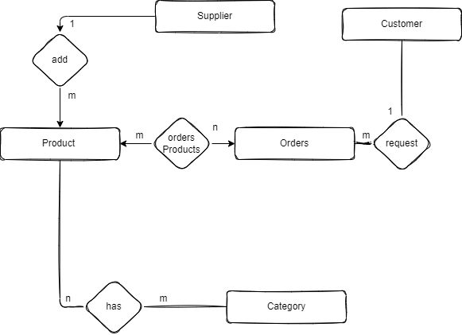
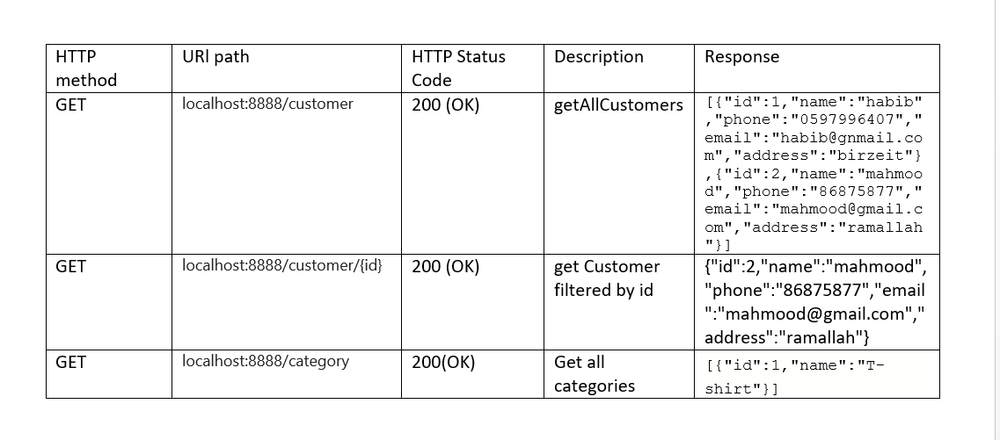
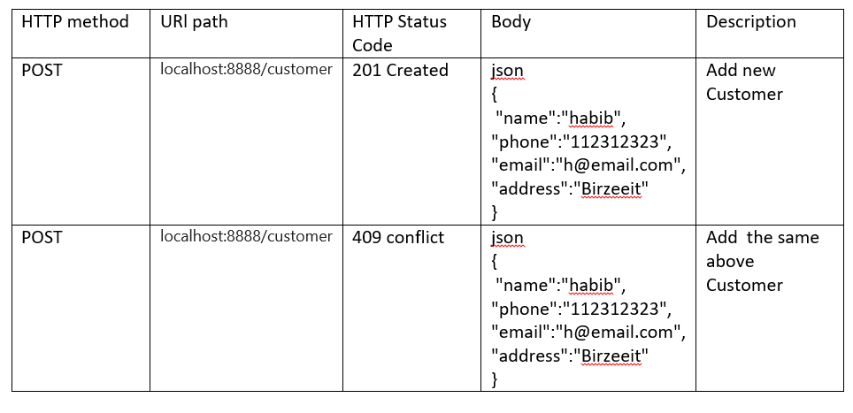

# comp438

* Database Design

-database details is
  spring.datasource.url=jdbc:mysql://localhost:3306/comp438
  spring.datasource.username=root
  and my password

- in our database we have mainly 5 tables, and relational tables.
- I tried to create post and get queries over some of these tables, mainly customer and category.

- I built this Spring boot application using three tier arch (Controller, Service , JPA Repository)
- Customer/Category Controller to recieve the apis, define their types and send them to service
- Customer/Category Service, to handle any logic and call repository apis
- Customer/Category Repository to deal with my database

* APIs I tried
* GET

* POST
